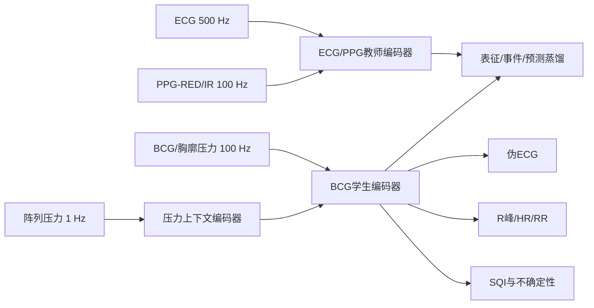

# 研究方向1与3：相关论文脉络与本项目可行研究思路

> 整理日期：2026-07-29
> 方向1：压力分布条件化、质量感知的跨体位 BCG→ECG 重建
> 方向3：以 ECG/PPG 为特权教师的多模态自监督表征学习
> 说明：本文档是用于选题和方案讨论的宽泛技术路线梳理，不是最终实验方案。后续应根据数据同步方式、传感器结构和生命体征参数来源进一步收敛。

---

## 1. 项目数据与两个方向的关系

当前 `data/raw` 中包含30名受试者、752个30秒窗口，主要模态为：

| 模态                               |            单个30秒窗口形状 | 推测采样率 | 在研究中的作用                                                 |
| ---------------------------------- | --------------------------: | ---------: | -------------------------------------------------------------- |
| 胸廓压力/BCG（文件名为`Breath`） |                        3000 |     100 Hz | 同时包含呼吸、心搏机械振动和运动伪迹，是部署阶段的核心无感信号 |
| ECG                                |                       15000 |     500 Hz | 电活动参考、重建目标、心拍和波形事件教师                       |
| PPG-IR                             |                        3000 |     100 Hz | 外周血流参考、跨模态教师、脉搏到达时刻                         |
| PPG-RED                            |                        3000 |     100 Hz | 与IR组成双波长PPG，可辅助质量评估、SpO₂和血流表征             |
| 阵列压力                           |                    30×1056 |       1 Hz | 体位、接触面积、接触负载、身体移动和信号质量上下文             |
| 体位标签                           | Supine/Left/Right/Prone/Sit |     每窗口 | 域标签、辅助任务、跨体位泛化评价                               |

五类体位窗口数量分别为：

- Supine：147；
- Right Side：140；
- Left Side：150；
- Prone：159；
- Sit：156。

需要注意：

1. 阵列压力约为1 Hz，不能提供逐心拍信息，适合建模体位、接触状态和运动上下文。
2. BCG只有100 Hz，而ECG为500 Hz。从100 Hz输入直接生成500 Hz ECG时，模型可以插值或生成高频细节，但这些细节未必由输入真实决定。因此应将“可靠心拍事件”和“生成波形外观”分开评价。
3. 大约12.5%的ECG窗口存在一定程度的ADC边界饱和，说明需要信号质量控制，而不能默认ECG标签始终可靠。
4. 双波长PPG不是重复通道，两者相关性中位数约为0.94，可以用于跨模态教师和质量一致性判断。
5. `20-杨骏` 最后3段阵列压力缺失；部分 `WholeData/*_FINAL.npy` 存在模态或形状异常。正式研究前应建立数据审计、重建和同步流程。
6. 年龄、性别和疾病信息基本缺失，当前数据更适合研究方法学、跨人跨体位泛化和生命体征估计，不宜直接宣称疾病诊断性能。

---

## 2. 两个方向的共同科学问题

ECG、BCG和PPG不是同一种生理量：

- ECG描述心脏电激动；
- BCG描述电激动之后的机械射血和身体反作用力；
- PPG描述更晚到达外周的血容量变化；
- 阵列压力描述人体与床垫的空间耦合条件。

可以把一轮心动周期简化为：

$$
\text{ECG电激动}
\rightarrow
\text{BCG机械射血}
\rightarrow
\text{PPG外周脉搏}
$$

三个模态共享心率和心搏节律，但在形态、延迟和噪声方面不同。因此，BCG→ECG不是严格的一一确定映射，而更接近：

$$
p(x_{\mathrm{ECG}}\mid x_{\mathrm{BCG}},c_{\mathrm{posture}},
c_{\mathrm{contact}},q)
$$

其中：

- $c_{\mathrm{posture}}$：体位；
- $c_{\mathrm{contact}}$：身体与床垫的接触方式和负载；
- $q$：信号质量；
- 输出最好是条件分布或带置信度的预测，而不仅是单一确定波形。

两个研究方向可以最终汇合为：

> 训练阶段利用 ECG、PPG、BCG、阵列压力学习共享的心血管表征；部署阶段仅使用 BCG+阵列压力，在跨人、跨体位和低质量条件下输出心拍事件、伪ECG及其可信度。

---

# 第一部分：方向1——压力条件化、质量感知的跨体位 BCG→ECG 重建

## 3. 代表性论文与技术演进

### 3.1 BiLSTM：把BCG→ECG作为监督式时序回归

**论文**

- Lingyin Zhang, *Reconstructing ECG from BCG for Non-Contact Cardiac Monitoring Using Bidirectional LSTM*, SPML 2024。
  本地文件：[Reconstructing ECG from BCG using BiLSTM](相关论文/3686490.3686526.pdf)
  DOI：[10.1145/3686490.3686526](https://doi.org/10.1145/3686490.3686526)

**研究思路**

1. 多个床垫BCG传感器同步采集；
2. 对多通道BCG进行下采样、归一化和端到端拼接；
3. 将1分钟信号重排为“60个时间步×每秒采样点”，显式引入“每分钟心率”的先验；
4. 使用BiLSTM提取前向和后向时序特征；
5. 通过全连接层逐点回归ECG；
6. 使用Huber损失降低离群点影响。

Huber损失可写成：

$$
\mathcal{L}_{\mathrm{Huber}}(e)=
\begin{cases}
\frac{1}{2}e^2,& |e|\leq\delta\\
\delta(|e|-\frac{1}{2}\delta),& |e|>\delta
\end{cases}
$$

其中 $e=\hat y-y$。

**关键技术**

- 多通道信号融合；
- 双向循环神经网络；
- 时序回归；
- 基于心率单位的输入重排；
- 鲁棒回归损失。

**结果与启示**

- 公共数据PCC约0.896，自采数据PCC约0.851；
- 证明BCG可以学习到与ECG共享的周期性结构；
- 多传感器融合有利于突出心搏成分。

**局限**

- 使用高度重叠的窗口并随机五折划分，可能产生相邻窗口泄漏；
- 没有严格证明跨受试者泛化；
- 不显式建模体位、压力分布和信号质量；
- 模型将ECG波形作为唯一目标，缺少心拍事件和临床时间间期约束。

对本项目而言，BiLSTM适合作为基础基线，但不适合作为最终创新主体。

---

### 3.2 多任务LLM/Transformer：用辅助生命体征任务约束重建

**论文**

- Boyang Zuo, Kun Lei, Xingjun Wang, *Adapting LLMs for Ballistocardiographic Signals: A Multi-Task Learning Framework for BCG to ECG Reconstruction*, RICAI 2024。
  本地文件：[Adapting LLMs for BCG Signals](相关论文/Adapting_LLMs_for_Ballistocardiographic_Signals_A_Multi-Task_Learning_Framework_for_BCG_to_ECG_Reconstruction.pdf)
  DOI：[10.1109/RICAI64321.2024.10911542](https://doi.org/10.1109/RICAI64321.2024.10911542)

**研究思路**

模型基于Qwen2-1.5B，将BCG编码结果和提示词嵌入送入LLM，共享表征连接三个任务头：

1. ECG波形重建；
2. 心率回归；
3. 心率异常二分类。

总损失为：

$$
\mathcal{L}_{\mathrm{total}} =
\lambda_{\mathrm{rec}}\mathcal{L}_{\mathrm{rec}}
+\lambda_{\mathrm{HR}}\mathcal{L}_{\mathrm{HR}}
+\lambda_{\mathrm{cls}}\mathcal{L}_{\mathrm{cls}}
$$

其中重建和HR回归使用MSE，异常检测使用二元交叉熵。

**关键技术**

- Transformer/LLM时序建模；
- 多任务学习；
- BCG专用卷积编码器；
- ECG解码器；
- 回归和分类辅助任务；
- 提示学习。

**结果与启示**

- ECG重建PCC约0.927；
- HR回归rRMSE约0.113；
- 辅助任务可以迫使共享编码器保留节律信息，而不是只拟合局部波形。

**局限**

- 1.5B参数模型对当前约6小时数据而言过大；
- LLM预训练的文本知识是否真正迁移到BCG仍需更严格消融；
- 论文没有充分说明按受试者划分的验证协议；
- 心率异常标签由心率阈值生成，与ECG重建目标高度相关，辅助信息仍较单一；
- 没有处理模态缺失、体位变化和输出不确定性。

本项目可继承的是“多任务共享表征”，不必照搬大型LLM。

---

### 3.3 BiLSTM+信号处理：把目标收缩为可靠的RRI估计

**论文**

- Seiichi Morokuma et al., *Prediction of ECG Signals from Ballistocardiography Using Deep Learning for the Unconstrained Measurement of Heartbeat Intervals*, Scientific Reports, 2025。
  本地文件：[Prediction of ECG from BCG for heartbeat intervals](相关论文/s41598-024-84049-0.pdf)
  在线链接：[Scientific Reports 15, 999](https://www.nature.com/articles/s41598-024-84049-0)

**研究思路**

1. PVDF床垫传感器采集BCG；
2. 使用15–50 Hz带通和全波整流，突出心搏基频及其谐波；
3. 使用三层BiLSTM回归伪ECG；
4. 18名受试者、4种卧姿，采用LOSO；
5. 额外在12名不同受试者的整夜记录中验证；
6. 重点评价伪ECG的R峰和RRI，而不是要求完整形态与真实ECG完全一致。

论文明确提出：如果目标是心搏间期，伪ECG形态不需要与真实ECG完全相同，只需R峰时序可靠。

**关键技术**

- 生理信号频带分析；
- 全波整流；
- BiLSTM回归；
- 留一受试者验证；
- 长时外部验证；
- RRI和Bland–Altman评价。

**结果与启示**

- 短时LOSO的RRI MAE约34 ms；
- 整夜外部数据的RRI相关系数约0.82，MAE约46 ms；
- 不同体位均可工作，但运动和异常心搏会导致失败；
- BCG机械起点与ECG R波之间存在PEP差异，逐点严格对齐可能不合理；
- 引入质量筛选可以降低误差，但会牺牲覆盖率。

该论文对本项目特别重要，因为它提示：

> 应把“事件时序可靠性”和“波形生成真实性”拆成两个输出，并显式报告覆盖率。

---

### 3.4 条件扩散模型：学习ECG条件分布和频域真实性

**论文**

- Yantao Zeng et al., *BiM-Diff: ECG Reconstruction from BCG with a Bidirectional Mamba-based Diffusion Model*, IEEE BIBM 2025。
  本地文件：[BiM-Diff](<相关论文/BiM-Diff- ECG Reconstruction from BCG with a Bidirectional Mamba-based Diffusion Model.pdf>)
  DOI：[10.1109/BIBM66473.2025.11356337](https://doi.org/10.1109/BIBM66473.2025.11356337)

**研究思路**

将BCG作为条件 $c$，从噪声逐步生成ECG：

$$
x_t=\sqrt{\bar\alpha_t}x_0+
\sqrt{1-\bar\alpha_t}\epsilon
$$

网络学习预测噪声：

$$
\epsilon_\theta(x_t,t,c)
$$

模型结构包括：

- 1D U-Net多尺度编码/解码；
- ResNet和线性注意力；
- 前向与后向Mamba组成BiMamba瓶颈；
- Classifier-Free Guidance增强BCG条件约束；
- MSE与STFT频域损失构成混合目标。

可以简化表示为：

$$
\mathcal{L} =
\mathcal{L}_{\mathrm{noise}}
+\lambda_{\mathrm{STFT}}\mathcal{L}_{\mathrm{STFT}}
$$

**关键技术**

- 条件扩散模型；
- 状态空间模型Mamba；
- 双向长程依赖；
- 多尺度U-Net；
- Classifier-Free Guidance；
- 时域+频域联合损失。

**结果与启示**

- 按受试者划分70/10/20；
- PCC约0.984，Fréchet Distance约0.085；
- 仅需25步采样。

**局限**

- 先按R峰将每个心拍切分并重采样至固定长度1024，弱化了真实连续节律和绝对心率变化；
- 更偏向“单心拍形态合成”，不完全等价于长时间连续ECG重建；
- 没有显式处理体位、接触压力、伪迹和不确定性校准；
- 高PCC和良好分布距离不能证明生成的细节具有诊断真实性。

如果本项目使用扩散模型，更有价值的方向不是单纯复现BiM-Diff，而是：

- 输出多个可能的ECG样本，估计预测分布；
- 将样本间方差解释为生成不确定性；
- 在低质量BCG时允许拒绝输出；
- 将压力上下文作为扩散条件。

---

### 3.5 Med2ECG：医学事件约束、跨人群与跨体位建模

**论文**

- Lin Chen et al., *Med2ECG: Medical-Guided BCG-To-ECG Reconstruction for Diverse Populations*, ACM/IEEE SenSys 2026。
  本地文件：[Med2ECG](<相关论文/Med2ECG Medical-Guided BCG-To-ECG Reconstruction for Diverse Populations.pdf>)
  DOI：[10.1145/3774906.3800463](https://doi.org/10.1145/3774906.3800463)

**研究思路**

Med2ECG将研究重点从逐点回归推进到“心脏事件结构对齐”，包括：

1. 多尺度卷积+BiGRU，兼顾J波局部瞬态、IJK复合波和较长节律；
2. Shared-Personalized Experts，通过MoE分离共享模式与个体/环境差异；
3. 延迟容忍的Structure-Aligned Loss；
4. 对P、QRS和T区域加权的Wave-Aware Loss；
5. 对P起点、QRS起止点和T终点进行监督的Diagnostic Anchor Loss；
6. LOSO验证和多体位敏感性分析。

延迟容忍思想可以写成：

$$
\tau^* =
\arg\min_{\tau\in[-\Delta,\Delta]}
\mathcal{L}_{\mathrm{sim}}(y,\operatorname{Shift}(\hat y,\tau))
$$

总目标为：

$$
\mathcal{L}_{\mathrm{total}} =
\mathcal{L}_{\mathrm{sim}}
+\lambda_1\mathcal{L}_{\mathrm{wave}}
+\lambda_2\mathcal{L}_{\mathrm{anchor}}
$$

**关键技术**

- 多尺度表征学习；
- Mixture-of-Experts；
- 共享与个性化表征；
- 延迟不变损失；
- ECG子波段/事件加权；
- 临床锚点检测；
- LOSO跨受试者评估。

**结果与启示**

- 仰卧PCC约0.92；
- 俯卧约0.84，左右侧卧约0.87；
- 说明体位改变确实会造成BCG衰减和压力分布变化；
- 仅靠共享模型无法完全消除个体和体位差异。

**与本项目可能重叠的部分**

Med2ECG已经覆盖：

- 多尺度编码；
- 跨受试者；
- 多体位测试；
- MoE；
- 医学形态与时间间期约束。

因此，本项目不能只做“多体位+MoE+医学损失”，否则与该工作较接近。可形成差异化的关键是：

1. 使用真实压力阵列，而不是只让网络从BCG中隐式猜测体位；
2. 将PPG作为训练期特权教师；
3. 建立显式SQI、质量门控和不确定性；
4. 研究模态缺失和部署时仅BCG+压力；
5. 强调事件可信度及选择性输出，而不是只追求波形指标。

---

## 4. 方向1的可行研究思路

### 思路1A：压力阵列条件化的BCG→ECG基础模型

**核心问题**

体位和接触负载改变了BCG传播路径。阵列压力是否能作为显式上下文，减少同一心脏事件在不同体位下的形态差异？

**技术路线**

1. BCG编码器 $E_b$ 提取心搏时序表征：

$$
z_b=E_b(x_{\mathrm{BCG}})
$$

2. 压力编码器 $E_p$ 从30帧压力阵列提取上下文：

$$
z_p=E_p(P_{1:30})
$$

可使用：

- 按参考硬件接线关系将 1056 路采集向量映射为每帧 77×32 压力图，再用 2D CNN 编码并做时间聚合；
- CNN+GRU处理1 Hz压力变化；
- 直接提取接触面积、压力中心、左右不对称度、总压力和帧间差异等可解释特征。

3. 使用FiLM对BCG特征进行条件调制：

$$
\operatorname{FiLM}(z_b,z_p) =
\gamma(z_p)\odot z_b+\beta(z_p)
$$

4. ECG解码器输出伪ECG：

$$
\hat x_{\mathrm{ECG}}=D_{\mathrm{ECG}}
(\operatorname{FiLM}(z_b,z_p))
$$

**关键技术**

- 多尺度时序表征学习；
- 压力图空间编码；
- 条件归一化/FiLM；
- 多模态特征融合；
- 跨体位域泛化。

**建议对比**

- BCG only；
- BCG+人工体位标签；
- BCG+阵列压力手工特征；
- BCG+阵列压力深度特征。

如果“压力特征”优于“体位标签”，说明压力阵列提供了接触强度等体位标签之外的信息。

**可行性**

高。模型不需要额外数据，且能直接利用本项目独有的压力阵列。

---

### 思路1B：生理表征与体位/接触干扰解耦

**核心问题**

BCG同时包含：

- 相对稳定的心脏节律信息；
- 受体位、体重分布和床垫耦合影响的干扰信息。

可以将BCG表征分解为：

$$
z_b=(z_{\mathrm{phys}},z_{\mathrm{nuisance}})
$$

其中：

- $z_{\mathrm{phys}}$：心率、心搏事件、机电活动；
- $z_{\mathrm{nuisance}}$：体位、接触负载、传感器耦合。

**技术路线**

1. 用ECG/PPG监督 $z_{\mathrm{phys}}$；
2. 用压力阵列和体位标签监督 $z_{\mathrm{nuisance}}$；
3. 对 $z_{\mathrm{phys}}$ 增加体位对抗分类器，使其难以预测体位：

$$
\min_{E_b}\max_{C_{\mathrm{pose}}}
\mathcal{L}_{\mathrm{pose}}
(C_{\mathrm{pose}}(z_{\mathrm{phys}}),y_{\mathrm{pose}})
$$

4. 对两个潜变量增加去相关或正交约束：

$$
\mathcal{L}_{\mathrm{orth}} =
\left\|z_{\mathrm{phys}}^\top
z_{\mathrm{nuisance}}\right\|_F^2
$$

5. ECG解码只使用 $z_{\mathrm{phys}}$，或使用经过控制的上下文融合。

**关键技术**

- 解耦表征学习；
- 域对抗学习；
- 梯度反转层；
- 正交/互信息约束；
- 不变风险思想；
- 体位域泛化。

**研究价值**

相比直接将体位输入模型，这条路线更强调：

> 学到“体位不变的心脏表征”，而不只是让模型记住五种体位。

**风险**

如果完全去除体位信息，可能同时删除一部分与心搏幅度有关的真实生理信息。可以采用“共享生理分支+压力条件补偿分支”，而不是绝对不变。

---

### 思路1C：质量感知的Mixture-of-Experts与选择性重建

**核心问题**

不同窗口中最可靠的模态可能不同。低质量BCG条件下，模型是否应该拒绝重建，或者切换到更合适的专家？

**信号质量标签来源**

可以构建弱监督SQI：

- ECG是否出现ADC饱和；
- BCG与ECG心率是否一致；
- BCG与PPG心搏周期是否一致；
- PPG-RED与PPG-IR是否一致；
- 压力图帧间差异是否表示身体移动；
- 多模态R峰/脉搏事件是否满足生理延迟范围。

将质量向量记为：

$$
q=[q_{\mathrm{BCG}},q_{\mathrm{ECG}},
q_{\mathrm{PPG}},q_{\mathrm{motion}}]
$$

使用质量和压力上下文进行专家路由：

$$
h_{\mathrm{out}} =
\sum_{k=1}^{K}
g_k(z_p,q)E_k(z_b)
$$

其中 $g_k$ 是门控权重。

专家可以分别偏向：

- 仰卧/高接触质量；
- 侧卧/局部接触；
- 俯卧；
- 坐位；
- 运动或低质量状态；
- 共享专家。

**不确定性建模**

模型同时输出均值和方差：

$$
(\hat y_t,\hat\sigma_t^2)=G(x)
$$

异方差高斯负对数似然为：

$$
\mathcal{L}_{\mathrm{NLL}} =
\sum_t
\left[
\frac{(y_t-\hat y_t)^2}{2\hat\sigma_t^2}
+\frac{1}{2}\log \hat\sigma_t^2
\right]
$$

预测方差可用于：

- 标记不可信时间点；
- 拒绝低质量窗口；
- 形成误差-覆盖率曲线；
- 防止模型在无信息时生成“看起来像ECG”的幻觉。

**关键技术**

- 信号质量指数；
- 弱监督学习；
- 稀疏Mixture-of-Experts；
- 质量门控；
- 异方差回归；
- 深度集成或Monte Carlo Dropout；
- 选择性预测。

**评价方式**

除普通误差外，应报告：

$$
\text{Coverage}(\theta) =
\frac{\#\{i:u_i<\theta\}}{N}
$$

以及保留样本上的风险：

$$
\text{Risk}(\theta) =
\frac{\sum_{i:u_i<\theta}\ell_i}
{\#\{i:u_i<\theta\}}
$$

形成“风险-覆盖率曲线”。这比只报告平均PCC更贴近真实部署。

---

### 思路1D：事件优先的双层ECG重建

**核心问题**

100 Hz BCG不足以唯一决定500 Hz ECG的所有高频细节。可以把“可信事件”与“外观波形”分成两层。

**层1：心脏事件检测**

输出：

- R峰概率序列；
- 心搏间期；
- HR；
- 可选的BCG J峰；
- 事件置信度。

$$
\hat p_R(t)=H_{\mathrm{event}}(z_b)
$$

事件损失可使用Focal/Tversky损失，解决峰值点远少于背景点的问题。

**层2：条件波形生成**

以事件序列、BCG表征和压力上下文为条件生成伪ECG：

$$
\hat x_{\mathrm{ECG}} =
D(z_b,z_p,\hat p_R)
$$

**关键技术**

- 多任务学习；
- 事件检测；
- 不平衡学习；
- 条件波形生成；
- 生理锚点监督；
- 粗到细/分层解码。

**优势**

- 即使完整波形不可靠，仍可输出可信RRI；
- 可单独报告事件任务性能；
- 避免“波形相关性高但R峰错位”的问题；
- 与Morokuma等工作的临床目标一致，但可进一步结合压力和质量。

**可行性**

很高，建议作为方向1的标准输出设计。

---

### 思路1E：压力条件化的概率生成模型

**核心问题**

同一BCG可能对应多个外观合理的ECG。与其输出单一结果，不如显式建模：

$$
p(x_{\mathrm{ECG}}\mid
x_{\mathrm{BCG}},z_p,q)
$$

**候选技术**

- 条件扩散模型；
- Conditional VAE；
- Flow Matching；
- Consistency Model；
- Latent Diffusion。

条件扩散可使用：

$$
\epsilon_\theta(x_t,t,z_b,z_p,q)
$$

在相同输入下采样多次：

$$
\hat x_{\mathrm{ECG}}^{(1)},\ldots,
\hat x_{\mathrm{ECG}}^{(M)}
$$

样本均值作为重建结果，样本方差作为生成不确定性。

**关键技术**

- 概率生成建模；
- 条件扩散；
- 频域损失；
- 多样性与校准；
- 生成不确定性。

**主要风险**

- 数据规模偏小，扩散模型容易记忆训练对象；
- 生成波形可能真实感高但与具体受试者不对应；
- 必须按受试者划分，并做最近邻记忆检查；
- 应优先保证事件时序，而不是追求视觉真实性。

**建议定位**

作为高风险扩展方向，不建议作为第一个基线。

---

# 第二部分：方向3——ECG/PPG作为特权教师的多模态自监督学习

## 5. 相关概念

### 5.1 什么是表征学习

表征学习不是直接从BCG预测最终标签，而是先学习一个潜在向量：

$$
z=E(x)
$$

希望 $z$ 保留心率、心搏形态、呼吸调制和血流动力学等信息，同时减少噪声、体位和设备差异。

学习完成后，$z$ 可以用于：

- ECG重建；
- R峰/心搏检测；
- HR、RR估计；
- 体位识别；
- 信号质量评估；
- 未来的血压或SpO₂任务。

---

### 5.2 什么是特权教师

在真实部署中，希望只使用无感信号：

$$
\text{推理输入}=\mathrm{BCG}+\mathrm{Pressure}
$$

但训练时可以使用更多同步模态：

$$
\text{训练输入}=
\mathrm{BCG}+\mathrm{Pressure}+
\mathrm{ECG}+\mathrm{PPG}
$$

ECG和PPG因此属于“训练时特权信息”。教师网络使用高质量或多模态输入，学生网络仅使用部署阶段可获得的信号：

$$
z_T=E_T(x_{\mathrm{ECG}},x_{\mathrm{PPG}})
$$

$$
z_S=E_S(x_{\mathrm{BCG}},P)
$$

通过知识蒸馏使学生接近教师：

$$
\mathcal{L}_{\mathrm{KD}} =
\left\|
Wz_S-z_T
\right\|_2^2
$$

推理时丢弃教师，仅保留学生。

---

## 6. 多模态自监督学习代表性论文

### 6.1 CLOCS：跨时间、空间和患者的心脏信号对比学习

**论文**

- Kiyasseh et al., *CLOCS: Contrastive Learning of Cardiac Signals Across Space, Time, and Patients*, ICML 2021。
  [PMLR论文页面](https://proceedings.mlr.press/v139/kiyasseh21a.html)

**研究思路**

将同一心脏信号的不同时间片、不同导联或不同相关视图作为正样本，其他样本作为负样本，使用对比学习获得通用ECG表示。

典型InfoNCE损失：

$$
\mathcal{L}_{\mathrm{NCE}} =
-\log
\frac{
\exp(\operatorname{sim}(z_i,z_i^+)/\tau)
}{
\sum_j\exp(\operatorname{sim}(z_i,z_j)/\tau)
}
$$

**关键技术**

- 对比表征学习；
- 正负样本构造；
- 跨时间/跨导联一致性；
- 线性探测和少标签微调。

**对本项目的启示**

可将同一30秒窗口中的ECG、BCG和PPG视为共享同一生理状态的不同视图，但需要考虑它们之间的生理延迟，不能直接逐点对齐。

---

### 6.2 大规模可穿戴ECG/PPG自监督基础模型

**论文**

- Abbaspourazad et al., *Large-scale Training of Foundation Models for Wearable Biosignals*, ICLR 2024。
  [ICLR论文页面](https://proceedings.iclr.cc/paper_files/paper/2024/hash/0d99a8c048befb6dd6e17d7684adacac-Abstract-Conference.html)

**研究思路**

- 使用约14.1万名参与者、约3年纵向ECG/PPG；
- 基于受试者级正样本构造；
- 使用随机信号增强；
- 使用动量编码器和正则化对比损失；
- 预训练后迁移到健康状态和人口学任务。

**关键技术**

- 大规模自监督预训练；
- Momentum Contrast；
- 受试者级正样本；
- 随机时序增强；
- Foundation Model；
- 线性探测和迁移学习。

**对本项目的启示**

本项目约6小时数据不足以从零训练基础模型，但适合：

- 使用公开预训练ECG/PPG编码器；
- 通过适配器迁移到本项目；
- 研究BCG学生能否对齐预训练教师的表征空间。

---

### 6.3 SleepFM：Leave-one-out多模态对比学习

**论文**

- Thapa et al., *SleepFM: Multi-modal Representation Learning for Sleep Across Brain Activity, ECG and Respiratory Signals*, 2024预印本，后续工作发表于Nature Medicine。
  [arXiv](https://arxiv.org/abs/2405.17766)
  [Nature Medicine后续工作](https://www.nature.com/articles/s41591-025-04133-4)

**研究思路**

普通两两对比只对齐两个模态。SleepFM采用leave-one-out思想：

- 用某一个模态作为查询；
- 让它接近其余模态融合出的同一时间段表征；
- 从而学习所有模态共享的生理状态。

**关键技术**

- 多模态对比学习；
- Leave-one-modality-out；
- 模态无关表示；
- 大规模睡眠预训练；
- 下游线性探测。

**对本项目的启示**

可以把：

- ECG；
- PPG；
- BCG心搏分量；
- BCG呼吸分量

作为不同生理视图，让任一模态预测“其余模态的共识表示”。阵列压力不一定作为生理正样本，而更适合做上下文和干扰变量。

---

### 6.4 PaPaGei：形态感知的PPG基础模型

**论文**

- Pillai et al., *PaPaGei: Open Foundation Models for Optical Physiological Signals*, ICLR 2025。
  [OpenReview/ICLR版本](https://openreview.net/pdf/1f7065a38efe7e5b317cb2b411e9d3c474d83c21.pdf)
  [arXiv](https://arxiv.org/abs/2410.20542)

**研究思路**

- 使用超过5.7万小时、约2000万个PPG片段；
- 不仅使用通用时序增强，还根据PPG形态和个体差异设计表征学习；
- 在多个健康、睡眠和心血管任务上迁移。

**关键技术**

- PPG形态感知表征；
- 大规模自监督；
- 域外泛化；
- 预训练编码器复用。

**对本项目的启示**

可以直接把PaPaGei或类似PPG模型作为教师编码器，避免用30人数据从零学习PPG表征。教师负责给出较稳定的血流动力学表示，BCG学生学习与其对齐。

---

### 6.5 TSTA-Net：时移校正和分层跨模态对比

**论文**

- Liu et al., *Self-Supervised Learning of ECG and PPG Signals for Multi-Modal Health Monitoring*, PMLR 2025。
  [PMLR论文页面](https://proceedings.mlr.press/v278/liu25d.html)

**研究思路**

- 使用残差时空Transformer校正传感器时移和运动伪迹；
- ECG、PPG双分支Transformer提取特征；
- 通过分层对比学习同时对齐局部和全局表示；
- 用于房颤检测等下游任务。

**关键技术**

- 时移校正；
- 双分支Transformer；
- 局部/全局分层对比学习；
- 运动伪迹鲁棒性；
- 跨受试者泛化。

**对本项目的启示**

ECG、BCG和PPG存在固定或变化延迟。对比学习前应增加：

- 可学习时移；
- 局部搜索窗口；
- 基于心搏事件的对齐；
- 延迟容忍相似度。

否则模型可能把真实的机电延迟误认为模态不一致。

---

### 6.6 PhysioME：面向缺失模态的对比+掩码重建

**论文**

- Lee et al., *PhysioME: A Robust Multimodal Self-Supervised Framework for Physiological Signals with Missing Modalities*, 2025预印本。
  [arXiv](https://arxiv.org/abs/2510.11110)

**研究思路**

1. 跨模态对比学习；
2. 随机掩盖部分模态或token；
3. 恢复解码器重建缺失模态；
4. 在训练中模拟传感器缺失；
5. 使模型能够处理不完整输入。

**关键技术**

- Masked Modeling；
- 模态Dropout；
- 缺失模态重建；
- 多模态对比；
- 恢复解码器。

**对本项目的启示**

本项目天然适合模拟：

- PPG-RED缺失；
- PPG-IR缺失；
- 阵列压力缺失；
- ECG仅在训练中存在；
- 部分BCG片段被运动破坏。

最终可以明确评价：

> 训练时四模态，推理时仅BCG+压力，性能下降多少？

---

### 6.7 CardioFM：ECG–PPG联合基础表征

**论文**

- *CardioFM: A Multimodal Foundation Model for Joint ECG and PPG Representation Learning*, 2026。
  [PMC页面](https://pmc.ncbi.nlm.nih.gov/articles/PMC13193117/)

**研究思路**

- 在约50万小时、约6.3万患者的ECG–PPG数据上预训练；
- 使用双向跨模态注意力；
- 使用自监督重建目标；
- 使用自适应残差向量量化；
- 统一支持疾病分类、QT估计、PAT估计和信号去噪。

**关键技术**

- 跨模态注意力；
- 向量量化；
- 统一离散潜在表示；
- 大规模跨场景预训练；
- ECG–PPG生理耦合。

**对本项目的启示**

ECG和PPG教师不一定需要分别训练。可以使用联合教师提供：

- 电活动表征；
- 外周血流表征；
- 两者之间的PAT；
- 对BCG学生更完整的心血管监督。

---

### 6.8 xMAE：利用ECG→PPG的有方向生理时序

**论文**

- Zhou et al., *Physiology-Aware Masked Cross-Modal Reconstruction for Biosignal Representation Learning*, 2026预印本。
  [arXiv](https://arxiv.org/abs/2605.00973)

**研究思路**

传统对比学习把ECG和PPG看作可互换视图，但真实生理过程有方向：

$$
\mathrm{ECG}\rightarrow\mathrm{PPG}
$$

xMAE使用跨模态掩码重建，让模型从一种模态预测另一种模态，同时保留时间先后关系。

**关键技术**

- Masked Autoencoder；
- 跨模态重建；
- 生理方向约束；
- 时间延迟表征；
- 设备和部位泛化。

**对本项目的启示**

本项目可以进一步扩展为：

$$
\mathrm{ECG}
\rightarrow
\mathrm{BCG}
\rightarrow
\mathrm{PPG}
$$

在预训练目标中显式保留：

- ECG R峰到BCG机械事件的延迟；
- BCG机械事件到PPG脉搏脚点的延迟；
- 呼吸对三个模态幅度和节律的调制。

这是比简单“同一窗口为正样本”更有生理意义的对齐方式。

---

## 7. 方向3的可行研究思路

### 思路3A：ECG/PPG特权教师→BCG+压力学生

**总体结构**



**教师**

教师输入ECG+双波长PPG，学习较稳定的心血管表征：

$$
z_T=E_T(x_{\mathrm{ECG}},
x_{\mathrm{PPG,IR}},
x_{\mathrm{PPG,RED}})
$$

**学生**

学生只输入可无感部署的BCG+压力：

$$
z_S=E_S(x_{\mathrm{BCG}},P)
$$

**蒸馏目标**

1. 表征蒸馏：

$$
\mathcal{L}_{\mathrm{feat}} =
\|Wz_S-z_T\|_2^2
$$

2. 相似度结构蒸馏：

$$
\mathcal{L}_{\mathrm{rel}} =
\|
Z_SZ_S^\top-Z_TZ_T^\top
\|_F^2
$$

3. 事件蒸馏：

$$
\mathcal{L}_{\mathrm{eventKD}} =
\operatorname{KL}(p_T(R)\|p_S(R))
$$

4. 输出蒸馏：

$$
\mathcal{L}_{\mathrm{predKD}} =
\|\hat y_S-\hat y_T\|_1
$$

**关键技术**

- Learning Using Privileged Information；
- Teacher–Student；
- 知识蒸馏；
- 跨模态表征对齐；
- 压力条件化；
- 部署模态约束。

**可行性**

高。即使不使用外部预训练模型，也可以先在本项目上验证特权教师是否有效。

---

### 思路3B：延迟容忍的跨模态对比学习

**普通做法的问题**

如果直接认为同一时刻的ECG、BCG和PPG必须相似，会忽略：

- ECG→BCG的PEP；
- BCG→PPG的传导时间；
- 不同设备的固定同步延迟。

**可行方法**

在时间窗口内搜索最匹配的正样本：

$$
s^+(i) =
\max_{\tau\in[-\Delta,\Delta]}
\operatorname{sim}
(z_{\mathrm{BCG}}(i),
z_{\mathrm{ECG}}(i+\tau))
$$

再代入InfoNCE。

也可以先用ECG R峰、BCG J峰、PPG脚点构建心拍级token，而不是使用固定采样点。

**正样本设计**

- 同一窗口、不同模态；
- 同一受试者、同一体位、相邻窗口；
- 同一心拍的ECG/BCG/PPG事件；
- 同一受试者不同体位，但HR接近的片段。

**负样本设计注意事项**

不能简单将其他受试者全部视为负样本，因为两个不同受试者可能具有相似HR和波形。可以采用：

- 去除HR非常接近的假负样本；
- 使用软标签相似度；
- BYOL/Barlow Twins等不依赖显式负样本的方法；
- 按节律和信号质量构造难负样本。

**关键技术**

- Cross-modal Contrastive Learning；
- Delay-tolerant Contrast；
- 事件级token；
- 假负样本消除；
- 自监督时序对齐。

---

### 思路3C：Masked Multimodal Modeling与缺失模态恢复

**预训练过程**

随机遮挡：

- BCG局部时间片；
- ECG局部时间片；
- 整个PPG通道；
- 整个压力模态；
- 某个30秒窗口中的高伪迹片段。

编码器根据可见信息恢复被遮挡内容：

$$
\hat x_m=D_m(z_{\setminus m})
$$

损失为：

$$
\mathcal{L}_{\mathrm{mask}} =
\sum_m
\frac{1}{|\Omega_m|}
\sum_{t\in\Omega_m}
\ell(\hat x_m(t),x_m(t))
$$

其中 $\Omega_m$ 为被遮挡区域。

**可以设置三类难度**

1. 点/短片段遮挡：学习局部连续性；
2. 长片段遮挡：学习节律；
3. 整模态遮挡：学习跨模态预测。

**关键技术**

- Masked Autoencoder；
- 模态Dropout；
- 跨模态补全；
- Curriculum Masking；
- 缺失模态鲁棒性；
- 生成式表征学习。

**本项目特色**

压力阵列只有1 Hz，不能要求其重建ECG细节，但可以：

- 用压力预测体位和运动上下文；
- 用BCG/PPG预测压力是否发生移动；
- 在压力缺失时由BCG低频运动信息补充上下文。

---

### 思路3D：生理有向图约束的跨模态预训练

**生理图**

可以将模态关系表示为有向图：

```text
ECG电活动 ──> BCG机械射血 ──> PPG外周脉搏
                    │
呼吸 ───────────────┴──> 幅度与节律调制
阵列压力 ──────────────> 观测条件/传播路径
```

**预训练任务**

1. ECG预测BCG事件；
2. ECG+BCG预测PPG脚点；
3. BCG预测ECG R峰附近的事件分布；
4. BCG低频分量预测呼吸率；
5. 压力阵列预测体位与接触状态；
6. 约束事件延迟满足合理范围。

例如：

$$
\Delta_{EB}=t_J-t_R
$$

$$
\Delta_{BP}=t_{\mathrm{PPGfoot}}-t_J
$$

可以增加延迟一致性损失：

$$
\mathcal{L}_{\mathrm{delay}} =
\left|
\hat\Delta_{EB}-\Delta_{EB}
\right|
+
\left|
\hat\Delta_{BP}-\Delta_{BP}
\right|
$$

**关键技术**

- 生理先验；
- 有向跨模态预测；
- 事件对齐；
- 时延表征学习；
- 多任务预训练。

**创新潜力**

高。与把模态视为可交换增强的通用对比学习相比，该思路更能体现ECG、BCG、PPG的生理因果顺序。

**主要风险**

- 当前BCG为100 Hz，事件时刻分辨率有限；
- 需要确认设备同步延迟；
- BCG J峰可能随体位变化而不稳定；
- 可以先使用软事件概率而不是硬峰值。

---

### 思路3E：外部基础模型迁移+轻量适配器

**核心问题**

当前数据规模不适合训练大型基础模型，但可以利用公开模型。

**可行路线**

1. 使用预训练ECG编码器；
2. 使用PaPaGei等预训练PPG编码器；
3. 冻结大部分教师参数；
4. 在本项目上训练轻量Adapter/LoRA；
5. 将教师表征蒸馏给BCG学生。

适配器可写为：

$$
h'=h+W_{\mathrm{up}}
\sigma(W_{\mathrm{down}}h)
$$

其中适配器参数远少于完整教师模型。

**关键技术**

- Foundation Model迁移；
- Parameter-efficient Fine-tuning；
- Adapter/LoRA；
- 跨模态蒸馏；
- 小样本领域适配。

**评价重点**

- 从零训练教师；
- 冻结预训练教师；
- 预训练教师+Adapter；
- 不同预训练来源的比较。

---

### 思路3F：多模态自监督预训练后进行多任务微调

预训练得到 $z_{\mathrm{phys}}$ 后，不只用于ECG重建，还应测试多个下游任务：

$$
\begin{aligned}
\hat x_{\mathrm{ECG}} &= H_{\mathrm{ECG}}(z)\\
\hat y_{\mathrm{HR}} &= H_{\mathrm{HR}}(z)\\
\hat y_{\mathrm{RR}} &= H_{\mathrm{RR}}(z)\\
\hat y_{\mathrm{pose}} &= H_{\mathrm{pose}}(z)\\
\hat y_{\mathrm{SQI}} &= H_{\mathrm{SQI}}(z)
\end{aligned}
$$

**关键技术**

- 预训练-微调范式；
- 多任务学习；
- Linear Probe；
- 少标签学习；
- 表征可迁移性评价。

**建议评价**

- 冻结编码器，只训练线性头；
- 使用1%、10%、50%、100%标签微调；
- 比较自监督预训练与随机初始化；
- 评价未见受试者、未见体位和低质量窗口。

如果自监督模型只在ECG重建上有效，而HR/RR/SQI等任务不提升，则说明其学到的可能是任务特定映射，而非通用生理表征。

---

## 8. 推荐的统一研究框架

方向1和方向3可以合并成一个两阶段框架。

### 阶段A：多模态自监督预训练

输入：

- ECG；
- BCG；
- PPG-RED/IR；
- 压力阵列；
- 体位标签仅作为辅助域信息。

总损失可以设计为：

$$
\mathcal{L}_{\mathrm{pretrain}} =
\lambda_{\mathrm{mask}}\mathcal{L}_{\mathrm{mask}}
+\lambda_{\mathrm{con}}\mathcal{L}_{\mathrm{contrast}}
+\lambda_{\mathrm{KD}}\mathcal{L}_{\mathrm{KD}}
+\lambda_{\mathrm{delay}}\mathcal{L}_{\mathrm{delay}}
+\lambda_{\mathrm{pose}}\mathcal{L}_{\mathrm{pose}}
$$

目标是获得：

- ECG/PPG教师表征；
- BCG学生表征；
- 压力上下文表征；
- 信号质量表征。

### 阶段B：质量感知的ECG重建微调

$$
\mathcal{L}_{\mathrm{finetune}} =
\lambda_1\mathcal{L}_{\mathrm{MAE}}
+\lambda_2(1-\rho(y,\hat y))
+\lambda_3\mathcal{L}_{\mathrm{STFT}}
+\lambda_4\mathcal{L}_{\mathrm{event}}
+\lambda_5\mathcal{L}_{\mathrm{NLL}}
$$

其中：

- $\mathcal{L}_{\mathrm{MAE}}$：逐点稳健误差；
- $1-\rho$：整体形状一致性；
- $\mathcal{L}_{\mathrm{STFT}}$：频谱结构；
- $\mathcal{L}_{\mathrm{event}}$：R峰和关键事件；
- $\mathcal{L}_{\mathrm{NLL}}$：不确定性校准。

部署时仅保留：

$$
x_{\mathrm{BCG}}+P
\rightarrow
\hat x_{\mathrm{ECG}},
\hat p_R,
\widehat{\mathrm{HR}},
\widehat{\mathrm{RR}},
\widehat{\mathrm{SQI}},
\hat\sigma
$$

---

## 9. 建议优先级

| 优先级 | 方案                                 |   创新性 | 可行性 | 风险 |
| -----: | ------------------------------------ | -------: | -----: | ---: |
|      1 | 事件优先+压力条件化的BCG→ECG        |       高 |     高 |   中 |
|      2 | ECG/PPG特权教师→BCG+压力学生        |       高 |     高 |   中 |
|      3 | 质量门控MoE+不确定性+选择性重建      |       高 |   中高 |   中 |
|      4 | 延迟容忍的跨模态对比学习             |     中高 |   中高 |   中 |
|      5 | Masked Multimodal Modeling与缺失模态 |     中高 |     中 |   中 |
|      6 | 生理/体位干扰解耦                    |       高 |     中 | 中高 |
|      7 | 压力条件化扩散/Flow生成              |       高 |   中低 |   高 |
|      8 | 从零训练大型BCG基础模型              | 低现实性 |     低 | 很高 |

最推荐的组合是：

> **压力条件化 + ECG/PPG特权教师 + 事件优先 + SQI/不确定性。**

它同时利用了本项目最独特的压力阵列、同步多模态和体位标签，也避开了单纯堆叠BiLSTM、LLM、Mamba或Diffusion的同质化竞争。

---

## 10. 建议的实验协议

### 10.1 数据划分

必须按受试者划分：

- LOSO；
- 或Group 5-fold。

不允许将同一受试者的相邻窗口随机分到训练集和测试集。

建议增加：

1. **跨受试者测试**：训练对象和测试对象完全分离；
2. **跨体位测试**：训练4种体位，测试未见的第5种；
3. **跨受试者+跨体位测试**：同时测试新人与新体位；
4. **模态缺失测试**：仅BCG、BCG+压力、BCG+PPG、完整模态；
5. **质量分层测试**：高、中、低SQI分别报告结果。

### 10.2 ECG重建指标

不应只报告PCC和RMSE，至少包括：

- MAE、RMSE、rRMSE；
- PCC；
- STFT或频谱距离；
- R峰Precision、Recall、F1；
- R峰时间误差；
- IBI/RR MAE；
- HR MAE；
- 可行时报告QRS/PR/QT误差；
- Bland–Altman；
- 风险-覆盖率曲线；
- 不确定性校准。

### 10.3 自监督表征指标

- Linear Probe；
- 少标签微调；
- 跨模态检索准确率；
- ECG/BCG/PPG心拍表征相似度；
- 下游HR、RR、体位、SQI任务；
- 未见体位和未见受试者泛化；
- 模态缺失性能下降；
- 蒸馏前后学生表征可视化。

### 10.4 必要消融

- 无压力阵列；
- 只使用体位标签；
- 无PPG教师；
- 无ECG教师；
- 无自监督预训练；
- 无延迟容忍；
- 无SQI门控；
- 无不确定性；
- 不同压力融合方式；
- 不同BCG频带或可学习滤波器。

---

## 11. 数据处理与技术风险

### 11.1 BCG中的呼吸和心搏解耦

当前胸廓压力信号同时包含低频呼吸和较高频心搏机械成分。建议避免只使用一个固定带通，可设计多分支滤波器组：

- 呼吸分支：约0.08–0.6 Hz；
- 低频心搏分支：约0.8–8 Hz；
- 高频机械振动分支：约8–40 Hz；
- 原始信号分支。

可以使用：

- Butterworth滤波器组；
- 小波分解；
- SincNet；
- 可学习滤波器；
- 多尺度卷积。

不同传感器的有效频带未必相同，最终应通过与ECG的相干谱分析确定。

### 11.2 采样率差异

ECG 500 Hz、BCG/PPG 100 Hz。

建议比较两种目标：

1. 将ECG下采样到100 Hz，先研究可靠事件和低带宽伪ECG；
2. 输出500 Hz，但明确高频细节属于条件生成，并报告不确定性。

不能因为模型输出为500 Hz，就默认它恢复了真实500 Hz诊断信息。

### 11.3 同步误差

PTT、PEP和事件级对齐都依赖精确同步。需要确认：

- 是否由同一采集卡同步；
- 各通道是否存在缓冲延迟；
- 文件写入时间是否等价于信号起始时间；
- 设备是否发生时钟漂移。

如果同步无法完全确认，应使用延迟搜索或可学习时移，并避免宣称毫秒级生理时间间隔。

### 11.4 标签和隐私

- 真实姓名必须替换为匿名ID；
- `information.txt` 缺少人口学资料；
- `parameters.npy` 中SBP/DBP/HR/SP/BR的来源和对齐方式需要单独确认；
- 异常ECG、缺失阵列压力和 `WholeData` 拼接错误应记录在质量清单中；
- 所有数据清洗规则必须仅由训练集确定，避免测试信息泄漏。

---

## 12. 可考虑的论文题目

### 方向1题目

1. **Pressure-Conditioned and Quality-Aware BCG-to-ECG Reconstruction under Posture Shifts**
2. **Event-First BCG-to-ECG Reconstruction with Contact-Pressure Context and Selective Prediction**
3. **Uncertainty-Aware Unobtrusive ECG Reconstruction from Mattress BCG across Body Postures**
4. **Disentangling Cardiac Dynamics and Contact Conditions for Posture-Robust BCG-to-ECG Translation**

### 方向3题目

1. **ECG and PPG as Privileged Teachers for Unobtrusive Cardiac Representation Learning from Mattress BCG**
2. **Physiology-Aware Cross-Modal Pretraining of ECG, BCG and PPG with Missing-Modality Robustness**
3. **Delay-Tolerant Multimodal Self-Supervised Learning for Electrical-Mechanical-Hemodynamic Cardiac Signals**
4. **From Multimodal Training to Contactless Inference: Distilling ECG–PPG Knowledge into Pressure-Conditioned BCG**

### 两方向合并题目

**Privileged Multimodal Pretraining and Pressure-Conditioned Selective ECG Reconstruction from Mattress Ballistocardiography**

---

## 13. 当前阶段建议

第一阶段可先实现以下最小研究闭环：

1. 建立数据审计、去标识化和按受试者划分的数据加载器；
2. 构建BCG-only 1D CNN/UNet基线；
3. 增加R峰事件头，形成“事件+波形”双任务；
4. 增加压力阵列编码器和FiLM条件化；
5. 构建ECG+PPG教师，进行BCG学生表征蒸馏；
6. 增加简单SQI和不确定性输出；
7. 做LOSO、跨体位和模态缺失实验；
8. 根据结果再决定是否引入MoE、对抗解耦或扩散模型。

这一路线能够逐步验证每个创新点是否真实有效，也便于形成清晰的消融实验。

---

## 14. 参考文献索引

### 本地BCG→ECG论文

1. Zhang, L. *Reconstructing ECG from BCG for Non-Contact Cardiac Monitoring Using Bidirectional LSTM*. SPML, 2024. [DOI](https://doi.org/10.1145/3686490.3686526)
2. Zuo, B., Lei, K., Wang, X. *Adapting LLMs for Ballistocardiographic Signals: A Multi-Task Learning Framework for BCG to ECG Reconstruction*. RICAI, 2024. [DOI](https://doi.org/10.1109/RICAI64321.2024.10911542)
3. Morokuma, S. et al. *Prediction of ECG Signals from Ballistocardiography Using Deep Learning for the Unconstrained Measurement of Heartbeat Intervals*. Scientific Reports, 2025. [Article](https://www.nature.com/articles/s41598-024-84049-0)
4. Zeng, Y. et al. *BiM-Diff: ECG Reconstruction from BCG with a Bidirectional Mamba-based Diffusion Model*. IEEE BIBM, 2025. [DOI](https://doi.org/10.1109/BIBM66473.2025.11356337)
5. Chen, L. et al. *Med2ECG: Medical-Guided BCG-To-ECG Reconstruction for Diverse Populations*. SenSys, 2026. [DOI](https://doi.org/10.1145/3774906.3800463)

### 多模态、自监督和基础模型

6. Kiyasseh, D., Zhu, T., Clifton, D. *CLOCS: Contrastive Learning of Cardiac Signals Across Space, Time, and Patients*. ICML, 2021. [PMLR](https://proceedings.mlr.press/v139/kiyasseh21a.html)
7. Abbaspourazad, S. et al. *Large-scale Training of Foundation Models for Wearable Biosignals*. ICLR, 2024. [Proceedings](https://proceedings.iclr.cc/paper_files/paper/2024/hash/0d99a8c048befb6dd6e17d7684adacac-Abstract-Conference.html)
8. Thapa, R. et al. *SleepFM: Multi-modal Representation Learning for Sleep Across Brain Activity, ECG and Respiratory Signals*. 2024. [arXiv](https://arxiv.org/abs/2405.17766)
9. Pillai, A. et al. *PaPaGei: Open Foundation Models for Optical Physiological Signals*. ICLR, 2025. [arXiv](https://arxiv.org/abs/2410.20542)
10. Liu, S. et al. *Self-Supervised Learning of ECG and PPG Signals for Multi-Modal Health Monitoring*. PMLR, 2025. [PMLR](https://proceedings.mlr.press/v278/liu25d.html)
11. Lee, C.-H. et al. *PhysioME: A Robust Multimodal Self-Supervised Framework for Physiological Signals with Missing Modalities*. 2025. [arXiv](https://arxiv.org/abs/2510.11110)
12. *CardioFM: A Multimodal Foundation Model for Joint ECG and PPG Representation Learning*. 2026. [PMC](https://pmc.ncbi.nlm.nih.gov/articles/PMC13193117/)
13. Zhou, H. et al. *Physiology-Aware Masked Cross-Modal Reconstruction for Biosignal Representation Learning*. 2026. [arXiv](https://arxiv.org/abs/2605.00973)
